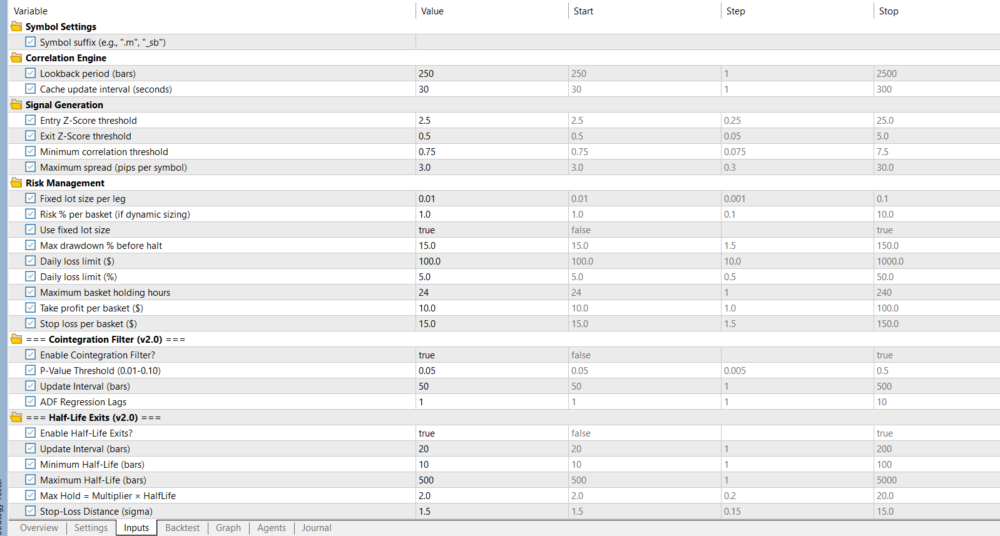

# D-Basket EA - Correlation Hedging Expert Advisor

**Version 2.00** | Advanced Statistical Optimization

A production-level MetaTrader 5 Expert Advisor implementing a three-pair correlation hedging strategy with advanced statistical optimization modules.



---

## 🎯 Quick Links

- **[Installation Guide](#installation)** - Get started in 5 minutes
- **[Documentation](./[agent]docs/README.md)** - Complete technical docs
- **[Quick Start Guide](./[agent]docs/QUICK_START.md)** - Essential setup
- **[Technical Specs](./[agent]docs/TECHNICAL_DOCUMENTATION.md)** - Architecture & algorithms

---

## 📊 Strategy Overview

This EA exploits the mathematical relationship between three currency pairs:

```
AUDNZD ≈ AUDCAD / NZDCAD
```

When this relationship diverges beyond statistical thresholds, the EA enters a hedged three-leg basket expecting mean reversion.

### Trading Logic

**Long Basket** (AUDNZD underpriced):
- Long AUDNZD + Short AUDCAD + Long NZDCAD

**Short Basket** (AUDNZD overpriced):
- Short AUDNZD + Long AUDCAD + Short NZDCAD

---

## ✨ Key Features

### v1.0 Core Features
- ✅ Multi-symbol management (single EA instance)
- ✅ Z-score based statistical signals
- ✅ 8-stage signal filtering pipeline
- ✅ Coordinated basket execution with rollback
- ✅ Circuit breaker risk management
- ✅ State recovery after restart
- ✅ Real-time performance tracking

### 🆕 v2.0 Optimization Features
- 🆕 **Cointegration Filter** - ADF test validates mean-reverting spreads
- 🆕 **Half-Life Exit Timing** - Ornstein-Uhlenbeck optimal exit calculation
- 🆕 **ATR Position Sizing** - Risk-parity lot allocation

---

## 📈 Expected Performance (v2.0)

| Metric | v1.0 Baseline | v2.0 Target | Improvement |
|--------|---------------|-------------|-------------|
| Win Rate | ~60% | 75-82% | +15-22% |
| Profit Factor | ~0.9 | 1.5-2.0 | +67-122% |
| Max Drawdown | ~15% | 8-12% | -20-47% |
| Trade Quality | All signals | Top 60-70% | Filtered |

---

## 🚀 Installation

### Quick Setup

1. **Copy Files**
   ```
   MQL5/Experts/DBasketEA_v2.mq5 → Your MT5/Experts/
   MQL5/Include/DBasket/*.mqh → Your MT5/Include/DBasket/
   ```

2. **Compile**
   - Open MetaEditor
   - Press F7 on `DBasketEA_v2.mq5`
   - Verify: 0 errors, 0 warnings

3. **Attach to Chart**
   - Open AUDCAD chart (any timeframe)
   - Drag EA from Navigator
   - Configure parameters
   - Enable AutoTrading

### File Structure

```
MQL5/
├── Experts/
│   ├── DBasketEA.mq5              # v1.0 EA
│   └── DBasketEA_v2.mq5           # v2.0 EA (recommended)
└── Include/
    └── DBasket/
        ├── DBasket_Defines.mqh
        ├── DBasket_Structures.mqh
        ├── DBasket_Logger.mqh
        ├── DBasket_CorrelationEngine.mqh
        ├── DBasket_SignalEngine.mqh
        ├── DBasket_TradeWrapper.mqh
        ├── DBasket_PositionManager.mqh
        ├── DBasket_RiskManager.mqh
        ├── DBasket_CointegrationEngine.mqh    # v2.0
        ├── DBasket_HalfLifeEngine.mqh         # v2.0
        └── DBasket_VolatilityBalancer.mqh     # v2.0
```

---

## ⚙️ Essential Parameters

### Core Settings
```
Entry Z-Score: 2.5          // Divergence threshold
Exit Z-Score: 0.5           // Mean reversion threshold
Min Correlation: 0.75       // Correlation filter
Max Drawdown: 15%           // Circuit breaker
```

### v2.0 Optimization Settings
```
// Cointegration Filter
InpCointEnabled: true       // Enable ADF test
InpCointPValue: 0.05        // P-value threshold

// Half-Life Exits
InpHLEnabled: true          // Enable O-U timing
InpHLExitMultiplier: 2.0    // Max hold = 2 × half-life

// ATR Position Sizing
InpATREnabled: true         // Enable risk parity
InpATRPeriod: 14            // ATR period
```

---

## ⚠️ Critical Requirements

> **HEDGING ACCOUNT MANDATORY**
> 
> This EA requires a broker account with hedging enabled. Netting accounts will NOT work.

### Broker Requirements
- ✅ Hedging account type
- ✅ All 3 symbols available (AUDCAD, NZDCAD, AUDNZD)
- ✅ Spreads < 3 pips per symbol
- ✅ Fast execution (< 500ms)
- ✅ No hedging restrictions

---

## 📚 Documentation

### User Guides
- **[Quick Start](./[agent]docs/QUICK_START.md)** - Installation & setup
- **[Parameter Guide](./MQL5/README.md)** - All input parameters explained

### Technical Documentation
- **[Architecture](./[agent]docs/TECHNICAL_DOCUMENTATION.md)** - System design & algorithms
- **[Development Summary](./[agent]docs/DEVELOPMENT_SUMMARY.md)** - Project history

### Research Documents
- **[Optimization Research](./[research]docs/)** - Statistical methods & formulas

---

## 🧪 Testing Workflow

### 1. Backtest (Recommended)
```
Symbol: AUDCAD
Timeframe: M15 or H1
Period: 3 years (2022-2025)
Mode: Every tick based on real ticks
Deposit: $1000+
```

### 2. Optimize Parameters
Use Strategy Tester's genetic algorithm to optimize:
- Entry/Exit Z-scores
- Correlation thresholds
- v2.0 cointegration p-value
- v2.0 half-life multiplier

### 3. Demo Account
- Deploy for 1+ month
- Monitor execution quality
- Compare to backtest results

### 4. Live Deployment
- Start with minimum capital
- Monitor for 1+ month
- Scale gradually

---

## 📊 Monitoring

The EA displays real-time metrics on chart:
- Trading status (NORMAL/WARNING/HALTED)
- Net P&L and percentage
- Daily P&L
- Current and max drawdown
- Basket count and win rate
- Consecutive losses

---

## 🛡️ Risk Management

### Circuit Breaker Triggers
| Condition | Warning | Trip (Halt) |
|-----------|---------|-------------|
| Drawdown | 8% | 15% |
| Daily Loss | - | $100 or 5% |
| Margin Level | 500% | 200% |
| Consecutive Losses | - | 6 |

### Emergency Exit
Immediately closes all positions when:
- Margin level < 150%
- System critical error detected

---

## 🔧 Troubleshooting

### EA Not Trading
1. Check circuit breaker status
2. Verify z-score meets entry threshold
3. Confirm spreads within limits
4. Check trading hours
5. Verify correlation above minimum
6. **v2.0**: Check cointegration status
7. **v2.0**: Verify half-life is valid

### "Hedging Account Required" Error
Your broker account is in netting mode. Contact your broker to switch to hedging.

### Partial Basket
The EA will automatically:
1. Attempt to complete the basket
2. If unable, close opened legs
3. Log the issue for review

---

## 📝 Version History

### v2.00 (December 28, 2025)
- 🆕 Cointegration Engine (ADF test)
- 🆕 Half-Life Engine (O-U process)
- 🆕 Volatility Balancer (ATR sizing)
- ✅ Expected win rate: 75-82%
- ✅ 3 new optimization modules

### v1.00 (December 27, 2025)
- ✅ Initial release
- ✅ 8 core modules
- ✅ Circuit breaker system
- ✅ Comprehensive logging

---

## ⚖️ Disclaimer

> **Risk Warning**
>
> Trading forex involves significant risk of loss. This EA is provided for educational purposes. Past performance does not guarantee future results. Always test thoroughly on demo accounts before live trading. Never risk more than you can afford to lose.

---

## 📄 License & Copyright

**Copyright © 2025 Dineth Pramodya**  
**Website**: [www.dineth.lk](https://www.dineth.lk)  
**All rights reserved.**

---

## 📞 Support

For technical questions:
1. Review [documentation](./[agent]docs/README.md)
2. Check [troubleshooting guide](./[agent]docs/QUICK_START.md#troubleshooting)
3. Enable DEBUG logging
4. Review log files

---

## 🔗 Additional Resources

- **MetaTrader 5**: https://www.metatrader5.com
- **MQL5 Documentation**: https://www.mql5.com/en/docs
- **Strategy Tester Guide**: https://www.mql5.com/en/articles/1486

---

*Last Updated: December 28, 2025*  
*Version: 2.00*  
*Developed by: Dineth Pramodya*
