```mermaid
flowchart LR
    A[Price Data] --> B[OLS Regression]
    B --> C[Extract Residuals]
    C --> D[AR1 Regression]
    D --> E[Calculate ADF Statistic]
    E --> F{ADF < -2.86?}
    F -->|Yes| G[Cointegrated ✓]
    F -->|No| H[Not Cointegrated ✗]
```

```mermaid
flowchart LR
    A[Spread Series] --> B[AR1 Regression]
    B --> C[Extract λ]
    C --> D{λ < 0?}
    D -->|Yes| E[Calculate Half-Life]
    D -->|No| F[Non-Reverting ✗]
    E --> G[τ = -ln2 / λ]
    G --> H[Max Hold = 2 × τ]
```

```mermaid
flowchart LR
    A[Get ATR14] --> B[Calculate Weights]
    B --> C[w_i = 1/ATR_i]
    C --> D[Normalize Σw = 1]
    D --> E[Lots_i = Base × w_i × 3]
```

# D-Basket EA v2.0 - Technical Documentation

## Table of Contents
1. [Architecture Overview](#architecture-overview)
2. [v1.0 Core Modules](#v10-core-modules)
3. [🆕 v2.0 Optimization Modules](#v20-optimization-modules)
4. [Data Flow](#data-flow)
5. [Signal Processing Pipeline](#signal-processing-pipeline)
6. [Risk Management System](#risk-management-system)
7. [Implementation Details](#implementation-details)
8. [Testing & Validation](#testing--validation)

---

## Architecture Overview

The D-Basket EA v2.0 implements a modular, event-driven architecture with **11 core modules** (8 from v1.0 + 3 new optimization modules).


### File Structure

```
MQL5/
├── Experts/
│   ├── DBasketEA.mq5                       # v1.0 EA (547 LOC)
│   └── DBasketEA_v2.mq5                    # 🆕 v2.0 EA (736 LOC)
└── Include/
    └── DBasket/
        ├── DBasket_Defines.mqh             # Constants & Enums (149 LOC)
        ├── DBasket_Structures.mqh          # Data Structures (524 LOC)
        ├── DBasket_Logger.mqh              # Logging System (424 LOC)
        ├── DBasket_CorrelationEngine.mqh   # Correlation Calc (401 LOC)
        ├── DBasket_SignalEngine.mqh        # Signal Generation (401 LOC)
        ├── DBasket_TradeWrapper.mqh        # Trade Execution (400 LOC)
        ├── DBasket_PositionManager.mqh     # Basket Management (572 LOC)
        ├── DBasket_RiskManager.mqh         # Risk Control (424 LOC)
        ├── 🆕 DBasket_CointegrationEngine.mqh  # ADF Test (450 LOC)
        ├── 🆕 DBasket_HalfLifeEngine.mqh       # O-U Half-Life (465 LOC)
        └── 🆕 DBasket_VolatilityBalancer.mqh   # ATR Sizing (360 LOC)
```

**Total Lines of Code**: ~5,307 (v1.0: ~2,880 | v2.0 additions: ~2,427)

---

## v1.0 Core Modules

### 1. Correlation Engine
**Purpose**: Calculate rolling correlation and z-score for the three-pair relationship.

**Key Features**:
- Circular buffer for price history
- Pearson correlation coefficient
- Z-score computation
- Cache optimization (30s validity)

**Mathematical Foundation**:
```
Synthetic Ratio = AUDCAD / NZDCAD
Spread = ratio - AUDNZD
Z-Score = (spread - μ) / σ
```

### 2. Signal Engine
**Purpose**: Generate entry/exit signals with 8-stage validation.

**Entry Filters**:
1. Data validity
2. No existing basket
3. Trading hours check
4. Rollover avoidance
5. Spread validation
6. Correlation threshold
7. Volatility check
8. Z-score threshold

### 3. Position Manager
**Purpose**: Execute coordinated 3-leg basket trades.

**Basket Configurations**:
| Direction | AUDNZD | AUDCAD | NZDCAD |
|-----------|--------|--------|--------|
| LONG | BUY | SELL | BUY |
| SHORT | SELL | BUY | SELL |

### 4. Risk Manager
**Purpose**: Monitor risk limits and circuit breaker.

**Risk Limits**:
- Drawdown: 8% warning, 15% trip
- Daily Loss: $100 or 5%
- Margin: 500% warning, 200% trip
- Consecutive Losses: 6 trips breaker

---

## 🆕 v2.0 Optimization Modules

### 1. Cointegration Engine (ADF Test)

**Purpose**: Validate that the spread is statistically mean-reverting before trading.

**Algorithm**:


**Mathematical Details**:

**Step 1: OLS Regression**
```
AUDNZD = α + β × (AUDCAD/NZDCAD) + ε
```
Extract residuals `ε` (the spread)

**Step 2: ADF Test on Residuals**
```
Δε_t = α + γ × ε_{t-1} + noise
ADF Statistic = γ / SE(γ)
```

**Step 3: Critical Values**
| ADF Value | P-Value | Interpretation |
|-----------|---------|----------------|
| < -3.43 | 0.01 | Strong cointegration |
| < -2.86 | 0.05 | Valid cointegration ✓ |
| < -2.57 | 0.10 | Weak cointegration |
| > -2.57 | > 0.10 | Not cointegrated ✗ |

**Impact**: Only trades when p < 0.05 (default), filtering out non-stationary spreads.

**Expected Improvement**: Win rate +8-15%

---

### 2. Half-Life Engine (Ornstein-Uhlenbeck)

**Purpose**: Calculate optimal exit timing based on mean-reversion speed.

**Algorithm**:


**Mathematical Details**:

**Step 1: AR(1) Regression**
```
Δspread_t = α + λ × spread_{t-1} + ε
```

**Step 2: Half-Life Calculation**
```
Half-Life (τ) = -ln(2) / λ
```

Where:
- λ < 0 indicates mean reversion
- τ = number of bars for 50% reversion

**Step 3: Exit Logic**
```
Max Holding Time = 2 × τ bars
Stop Loss = Entry Z-Score + 1.5σ
```

**Example**:
- If λ = -0.05, then τ = 13.9 bars
- Max hold = 27.8 bars (~28 bars)
- If spread diverges further by 1.5σ, exit immediately

**Impact**: Prevents holding positions too long or exiting too early.

**Expected Improvement**: Drawdown -15-20%

---

### 3. Volatility Balancer (ATR-Based)

**Purpose**: Balance risk across all 3 legs using inverse volatility weighting.

**Algorithm**:


**Mathematical Details**:

**Step 1: ATR Calculation**
```
ATR_i = 14-period Average True Range for symbol i
```

**Step 2: Inverse Volatility Weights**
```
weight_i = (1 / ATR_i) / Σ(1 / ATR_j)
```

**Step 3: Lot Allocation**
```
lots_i = base_lots × weight_i × 3
```

**Example**:
| Symbol | ATR | 1/ATR | Weight | Base=0.01 | Final Lots |
|--------|-----|-------|--------|-----------|------------|
| AUDCAD | 0.0050 | 200 | 0.40 | 0.01 | 0.012 |
| NZDCAD | 0.0040 | 250 | 0.50 | 0.01 | 0.015 |
| AUDNZD | 0.0080 | 125 | 0.10 | 0.01 | 0.003 |

Result: High-volatility AUDNZD gets smaller lot, low-volatility NZDCAD gets larger lot.

**Impact**: Equal risk contribution from each leg.

**Expected Improvement**: Sharpe ratio +10-15%

---

## Data Flow

### v2.0 OnTick Event Processing


---

## Signal Processing Pipeline

### v2.0 Entry Validation

```mermaid
flowchart TD
    START([Entry Signal Request]) --> F1{Data Valid?}
    F1 -->|No| REJECT[❌ Reject]
    F1 -->|Yes| F2{🆕 Cointegrated?}
    F2 -->|No| REJECT
    F2 -->|Yes| F3{🆕 Half-Life Valid?}
    F3 -->|No| REJECT
    F3 -->|Yes| F4{Trading Hours?}
    F4 -->|No| REJECT
    F4 -->|Yes| F5{Spread OK?}
    F5 -->|No| REJECT
    F5 -->|Yes| F6{Correlation > Min?}
    F6 -->|No| REJECT
    F6 -->|Yes| F7{|Z-Score| > Entry?}
    F7 -->|No| REJECT
    F7 -->|Yes| ACCEPT[✅ Accept Signal]
    
    style F2 fill:#FF6B6B
    style F3 fill:#FF6B6B
    style ACCEPT fill:#4CAF50
    style REJECT fill:#f44336
```

### v2.0 Exit Logic

```mermaid
flowchart TD
    START([Check Exit]) --> E1{Z-Score Reverted?}
    E1 -->|Yes| EXIT1[Mean Reversion Exit]
    E1 -->|No| E2{P&L ≥ TP?}
    E2 -->|Yes| EXIT2[Take Profit]
    E2 -->|No| E3{P&L ≤ SL?}
    E3 -->|Yes| EXIT3[Stop Loss]
    E3 -->|No| E4{🆕 Bars > 2×HalfLife?}
    E4 -->|Yes| EXIT4[Half-Life Time Exit]
    E4 -->|No| E5{🆕 Z > Entry+1.5σ?}
    E5 -->|Yes| EXIT5[Half-Life Variance SL]
    E5 -->|No| E6{🆕 Coint p > 0.10?}
    E6 -->|Yes| EXIT6[Cointegration Break]
    E6 -->|No| E7{Correlation < 0.5?}
    E7 -->|Yes| EXIT7[Correlation Break]
    E7 -->|No| HOLD[Hold Position]
    
    style E4 fill:#FF6B6B
    style E5 fill:#FF6B6B
    style E6 fill:#FF6B6B
```



---

## Implementation Details

### v2.0 Input Parameters

```mql5
// === v2.0 OPTIMIZATION SETTINGS ===

// Cointegration Filter
input bool     InpCointEnabled = true;      // Enable?
input double   InpCointPValue = 0.05;       // P-Value Threshold
input int      InpCointUpdateBars = 50;     // Update Interval (bars)
input int      InpCointADFLags = 1;         // ADF Lags

// Half-Life Exits
input bool     InpHLEnabled = true;         // Enable?
input int      InpHLUpdateBars = 20;        // Update Interval (bars)
input int      InpHLMinValue = 10;          // Min Half-Life (bars)
input int      InpHLMaxValue = 500;         // Max Half-Life (bars)
input double   InpHLExitMultiplier = 2.0;   // Max Hold Multiplier
input double   InpHLStopLossSigma = 1.5;    // SL Distance (sigma)

// ATR Position Sizing
input bool     InpATREnabled = true;        // Enable?
input int      InpATRPeriod = 14;           // ATR Period
input double   InpATRMinWeight = 0.15;      // Min Weight per Symbol
input double   InpATRMaxWeight = 0.50;      // Max Weight per Symbol
```

### v2.0 Data Structures

#### CointegrationData
```mql5
struct CointegrationData {
    double adfStatistic;        // ADF test statistic
    double pValue;              // Approximate p-value
    double beta;                // Hedge ratio from OLS
    double alpha;               // Intercept
    double residualStdDev;      // Residual std dev
    datetime lastUpdateTime;
    bool isCointegrated;        // p < threshold
    bool isValid;
};
```

#### HalfLifeData
```mql5
struct HalfLifeData {
    double lambda;              // AR(1) coefficient
    double halfLife;            // Calculated half-life (bars)
    double sigma;               // Residual std dev
    double ouVariance;          // O-U variance
    datetime lastUpdateTime;
    bool isMeanReverting;       // lambda < 0
    bool isValid;
};
```

#### VolatilityData
```mql5
struct VolatilityData {
    double atr[NUM_SYMBOLS];    // ATR values
    double weights[NUM_SYMBOLS]; // Inverse vol weights
    double adjustedLots[NUM_SYMBOLS]; // Final lots
    datetime lastUpdateTime;
    bool isValid;
};
```

---

## Testing & Validation

### Compilation Status
✅ **v1.0**: Successfully compiled with 0 errors, 0 warnings  
✅ **v2.0**: Successfully compiled with 0 errors, 0 warnings

### v2.0 Expected Performance

| Metric | v1.0 Baseline | v2.0 Target | Improvement |
|--------|---------------|-------------|-------------|
| Win Rate | ~60% | 75-82% | +15-22% |
| Profit Factor | ~0.9 | 1.5-2.0 | +67-122% |
| Max Drawdown | ~15% | 8-12% | -20-47% |
| Trade Frequency | High | -30-40% | Quality over quantity |
| Sharpe Ratio | ~0.5 | 0.8-1.2 | +60-140% |

### Testing Workflow


### Key Validation Points

1. **Cointegration**: p-value should be < 0.05 for 60-80% of potential trades
2. **Half-Life**: Should range 10-200 bars for most spreads
3. **ATR Weights**: Should vary between 0.15-0.50 per symbol
4. **Win Rate**: Should exceed 70% in backtests
5. **Profit Factor**: Should exceed 1.5 in backtests

---

## Configuration Guidelines

### v2.0 Conservative Settings
```
// Cointegration
InpCointPValue = 0.01          // Very strict
InpCointUpdateBars = 30        // Frequent updates

// Half-Life
InpHLExitMultiplier = 1.5      // Earlier exits
InpHLStopLossSigma = 1.0       // Tighter SL

// ATR
InpATRPeriod = 20              // Longer period
```

### v2.0 Moderate Settings (Default)
```
// Cointegration
InpCointPValue = 0.05          // Standard
InpCointUpdateBars = 50        // Balanced

// Half-Life
InpHLExitMultiplier = 2.0      // Standard
InpHLStopLossSigma = 1.5       // Balanced

// ATR
InpATRPeriod = 14              // Standard
```

### v2.0 Aggressive Settings
```
// Cointegration
InpCointPValue = 0.10          // More permissive
InpCointUpdateBars = 100       // Less frequent

// Half-Life
InpHLExitMultiplier = 3.0      // Longer holds
InpHLStopLossSigma = 2.0       // Wider SL

// ATR
InpATRPeriod = 10              // Shorter period
```

---

## Version History

### v2.00 (2025-12-28)
- 🆕 **Cointegration Engine** - ADF test for spread stationarity
- 🆕 **Half-Life Engine** - Ornstein-Uhlenbeck mean-reversion timing
- 🆕 **Volatility Balancer** - ATR-based risk parity sizing
- ✅ 3 new optimization modules (~1,275 LOC)
- ✅ Enhanced entry/exit logic
- ✅ Comprehensive v2.0 documentation
- ✅ Expected win rate: 75-82%

### v1.00 (2025-12-28)
- ✅ Initial implementation
- ✅ 8 modular components
- ✅ Circuit breaker system
- ✅ Comprehensive logging
- ✅ Fixed MQL5 deprecations

---

## Support & Resources

### Documentation Files
- `README.md` - Documentation index
- `QUICK_START.md` - Installation and setup
- `DEVELOPMENT_SUMMARY.md` - Project history
- `TECHNICAL_DOCUMENTATION.md` - This file

### Source Code
- `MQL5/Experts/DBasketEA.mq5` - v1.0 EA
- `MQL5/Experts/DBasketEA_v2.mq5` - v2.0 EA
- `MQL5/Include/DBasket/*.mqh` - All modules

### External References
- MQL5 Documentation: https://www.mql5.com/en/docs
- Cointegration Theory: Engle-Granger (1987)
- Ornstein-Uhlenbeck Process: Statistical mean reversion
- ATR Indicator: Wilder (1978)

---

---

## 📄 License & Copyright

**Copyright © 2025 Dineth Pramodya**  
**Website**: [www.dineth.lk](https://www.dineth.lk)  
**All rights reserved.**

---

*Last Updated: December 28, 2025*  
*Documentation Version: 2.00*  
*Developed by: Dineth Pramodya*
